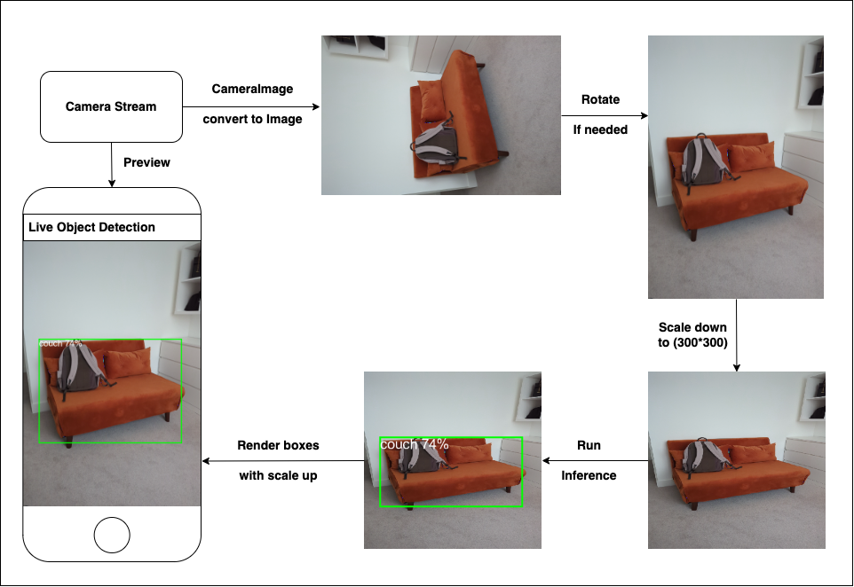
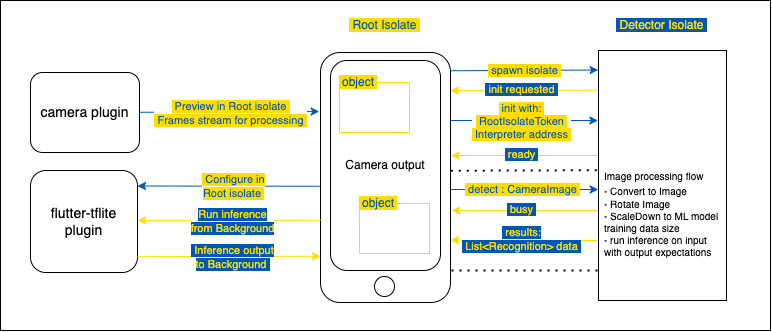
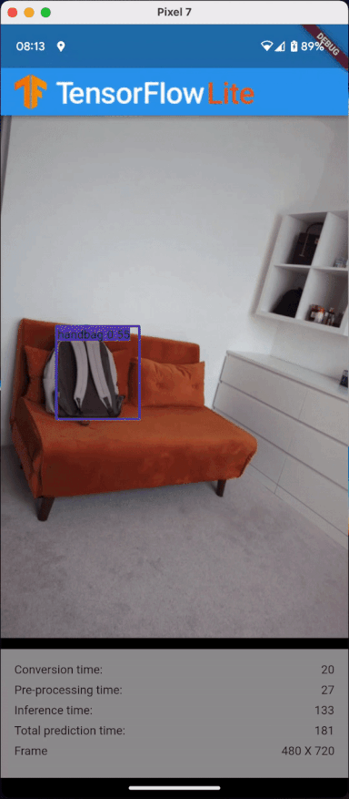

# devFest London 2023

This is a project sample for a workshop, which happens at devFest London on November 18th, 2023
This project is supposed to show how to work with Object Detection on live image streams, using
[tflite_flutter](https://pub.dev/packages/tflite_flutter) package and focused mostly on the
"background part" of the detection and work with isolates.

## Overview

Object detection applies on an image stream from camera (portrait mode only for the showcase
purpose).
All expensive and heavy operations are performed in a separate background isolate.
Flow is explained in the article [Codemagic Blog](https://blog.codemagic.io/live-object-detection-on-image-stream-in-flutter/)

## Flows

## How to start

Run 'sh ./scripts/download_model.sh' from your repo core folder to download tf models.

## Sample output

||||
